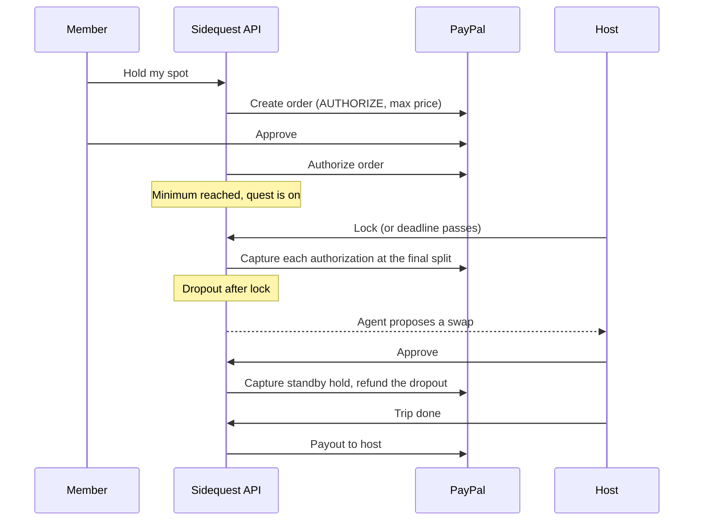

# Sidequest

Group adventures that only run if enough people commit.

Everyone who joins places a PayPal **authorization hold** at the max price. Nobody is charged unless the quest reaches its minimum. When it locks, each hold is **captured at the final split**, which drops with every extra person. After the trip, the host is paid through **PayPal Payouts**. A Claude agent plans quests, runs the group chat, and handles dropouts, swaps and cost changes. It can only *propose* money moves, and the host approves each one.

Built for the [PayPal AI Hackathon](https://paypalaihackathon.devpost.com).


## Why it's different

Most group payments collect money first and sort out refunds later. Sidequest uses the authorize-then-capture model PayPal already has, so the group's commitment is real but nobody's money moves until the plan does.

| PayPal capability | Where Sidequest uses it |
|---|---|
| Orders v2, `intent: AUTHORIZE` | Holding a spot. The hold is the price for the minimum group, the most anyone can pay. |
| Capture authorization (partial, `final_capture`) | Locking a quest. Each hold is captured at the real split, always at or below the hold. |
| Void authorization | Leaving before lock, quests that never tip, and standby holds after the trip. |
| Reauthorize | Holds older than the 3 day honor period are reauthorized before capture. |
| Refund capture (partial) | Dropout swaps after lock, and refunds when costs come in under. |
| Payouts v1 | Paying the host automatically 24 hours after the trip, unless a member reports a problem. |
| Invoicing, through the **PayPal Agent Toolkit** | Billing each person when costs come in over, with the receipts behind the charge linked on the invoice. |
| PayPal Agent Toolkit, adapted for Claude | The quest agent can call `get_order_details` and `get_invoice`. |
| Webhooks with signature verification | `CHECKOUT.ORDER.APPROVED` places holds for link-based approvals. Capture, void, refund and payout events confirm the money log. |
| JS SDK Smart Buttons | PayPal, Venmo and cards, with `intent=authorize`. Pay Later is turned off because installments can't be held. |

And for agentic commerce: **Sidequest is an MCP server.** Claude, ChatGPT or any MCP client can find quests and start a hold. The person approves the hold on PayPal's own page, so an agent can commit you to a plan but can never spend without you.

## How it works



### The host is paid by escrow, not by trust

Members' money is captured when the quest locks, so nobody can refuse to pay. The opposite risk is the host taking the money and not running the trip, so:

- The payout releases on its own **24 hours after the trip ends** (`PAYOUT_HOLD_HOURS`). The host can't pull it early.
- Any member who paid can **report a problem**, by button or by telling the agent. That pauses the payout until the host resolves it.
- A payout also waits while any money change is pending the host's approval.

### Settle up runs on receipts

After the trip, the host adds receipt photos. Claude reads each one (merchant, date, total, and which shared cost it pays for) with a forced tool call, and the engine runs checks that don't depend on the model: duplicate images are rejected, dates outside the trip and totals far above the estimate are flagged, and anything that isn't a receipt is rejected. The settle-up is computed from the receipts: lines with receipts cost what the receipts add up to, and the rest keep their estimate. Members see the receipts on the approval card, and each PayPal invoice includes the receipt details and a link to the image.

### The agent's guardrails

The agent never moves money on its own. It has five tools of its own plus two read-only PayPal Agent Toolkit tools:

- `get_quest_state` and `price_for` read the quest.
- `leave_quest` acts only for the person speaking. Before lock it voids their own hold. After lock it becomes a proposal.
- `propose_money_actions` creates a proposal (void, promote, refund or invoice) that only the host can approve.
- `add_stop_note` saves answers to the plan.

Every proposal is re-validated by the engine at approval time. A capture can never exceed the authorization, and a refund can never exceed what was captured. Member messages are treated as data, so one person can't talk the agent into moving someone else's money.

## Quality

- **Every money move is serialized per quest.** Two people can't take the same seat, and a webhook and a click can't authorize the same order twice.
- **Each approval runs once.** Proposals are claimed atomically, and duplicates collapse into one card.
- **No money for closed quests.** If a quest closes while someone is on PayPal's approval page, their order is never authorized.
- **Holds fit PayPal's window.** Join deadlines must be within 28 days, because authorizations last 29. Holds older than 3 days are reauthorized before capture.
- **Agent limits.** Chat is rate limited. Only the host and people on a quest can trigger money proposals.
- **CI** runs 19 backend tests (money lifecycle, races, closed quests, migrations, webhooks, MCP, and the Claude tool loop through the real SDK) plus frontend type checks, lint and a production build.

## Run it locally (no keys needed)

Requires Python 3.11+ and Node 18+.

```bash
# Backend
cd backend
python3 -m venv .venv && source .venv/bin/activate
pip install -r requirements.txt
pip install --no-deps paypal-agent-toolkit==1.11.0
cp .env.example .env
uvicorn main:app --reload

# Frontend, in a second terminal
cd frontend
cp .env.example .env.local
npm install
npm run dev
```

Open http://localhost:3000. Without keys, PayPal runs in mock mode and the agent runs offline, so everything works end to end. Five demo quests are seeded, each at a different stage.

## Turn on the PayPal sandbox

1. At [developer.paypal.com](https://developer.paypal.com), open **Apps & Credentials**, choose **Sandbox**, and create an app. Copy the client ID and secret into `backend/.env` as `PAYPAL_CLIENT_ID` and `PAYPAL_CLIENT_SECRET`.
2. Under **Sandbox accounts**, make sure you have a business account (it receives holds and sends payouts) and one or more personal accounts (to approve holds).
3. Run the check script. It walks through authorize, partial capture, refund, void, payout and an Agent Toolkit invoice against the real sandbox:
   ```bash
   cd backend && python scripts/check_sandbox.py
   ```
4. Restart the backend. The header badge now says **PayPal sandbox**, and the hold button is PayPal's own Smart Button.
5. Optional: give the demo crowd real sandbox holds. Generate a test card under **Testing tools > Card generator** and set `DEMO_CARD_NUMBER`. Without it, demo crowd joins are simulated and labeled as simulated in the money log.

### Webhooks

Add a webhook in your sandbox app pointing to `https://<your-api>/webhooks/paypal` with these events:

`CHECKOUT.ORDER.APPROVED`, `PAYMENT.AUTHORIZATION.CREATED`, `PAYMENT.AUTHORIZATION.VOIDED`, `PAYMENT.CAPTURE.COMPLETED`, `PAYMENT.CAPTURE.DENIED`, `PAYMENT.CAPTURE.REFUNDED`, `PAYMENT.PAYOUTSBATCH.SUCCESS`, `PAYMENT.PAYOUTS-ITEM.SUCCEEDED`

Set the webhook's ID as `PAYPAL_WEBHOOK_ID`. Each event is verified with PayPal's `verify-webhook-signature` endpoint and stored once.

### Judge access

Set `DEMO_BUYER_EMAIL` and `DEMO_BUYER_PASSWORD` to a sandbox personal account. The guided tour shows them in step 1, so judges can approve holds. They only appear in sandbox mode with `DEMO_MODE=1`, and they are sandbox test credentials, never live ones.

## Turn on Claude

Set `ANTHROPIC_API_KEY` in `backend/.env`. The quest builder then uses a forced `draft_quest` tool call, and the quest agent runs a full tool-use loop. `ANTHROPIC_MODEL` defaults to `claude-sonnet-5-5`.

## Connect an AI assistant (MCP)

The MCP endpoint is `https://<your-api>/mcp/` (streamable HTTP). Tools: `list_quests`, `get_quest`, `hold_spot`, `check_my_spot`. The **For AI agents** page in the app has copyable config for Claude Desktop and custom connectors.

## Deploy

`render.yaml` deploys both services on [Render](https://render.com) with one blueprint. Use a [Supabase](https://supabase.com) Postgres connection string for `DATABASE_URL` (Project settings > Database > Session pooler). Tables are created on first start.

To deploy the frontend on Vercel instead, import the repo with root directory `frontend` and set `NEXT_PUBLIC_API_URL`. The backend's CORS rules already allow `sidequest*.vercel.app`.

Keep `DEMO_MODE=1` for judging. It turns on one-click personas and the demo controls.

## For judges: the two minute tour

Click **Take the 2-minute tour** on the home page. You get a private copy of the hero quest, so your clicks never collide with another judge's, and a checklist that walks the full PayPal lifecycle:

1. **Hold your spot** as Leo with the real PayPal button. Seat 5 fills and the quest tips.
2. **Fill the van.** Everyone's share drops from $81.00 to $67.29.
3. **Lock and charge** as Hon, the host. PayPal captures every hold at the final split.
4. **Drop out after paying** as Dev. The agent turns it into a swap request for the host.
5. **Approve the swap.** The standby hold is captured and Dev is refunded.
6. **Settle up with receipts.** Add the sample gas receipt. Claude reads it, and each person gets a PayPal invoice for the overage with the receipt linked.
7. **Pay the host.** In real use this releases on its own 24 hours after the trip. The demo skips the wait.

Each step switches to the right person for you. The PayPal sandbox buyer login is shown inside step 1. The money log on the quest page lists every PayPal call with its ID.

Other things to try:
- Open any quest from **Departures** to see the invite page a new person gets before joining.
- On **For AI agents**, call the MCP tools from the browser and get a PayPal approval link back.
- Use **Demo controls** on the other quests to add people or jump to a deadline.

## Tests

```bash
cd backend
python -m pytest tests/test_flow.py        # full money lifecycle, webhooks, MCP
python -m pytest tests/test_qa.py          # races, closed quests, resets, limits, migrations
python -m pytest tests/test_agent_wire.py  # Claude tool loop through the real SDK, on a fake transport
```

Run the two files separately. Each sets its own environment.

## Project layout

```
backend/
  main.py                 FastAPI app, scheduler, MCP mount
  app/engine.py           Quest lifecycle. Every money move goes through here.
  app/paypal/gateway.py   Orders, Payments, Payouts, Webhooks (sandbox and mock)
  app/paypal/toolkit.py   PayPal Agent Toolkit tools, adapted for Claude
  app/agent/builder.py    One sentence to a quest draft
  app/agent/keeper.py     The quest agent and its guarded tools
  app/mcp_server.py       Sidequest as an MCP server
  app/pricing.py          The split
  scripts/check_sandbox.py
frontend/
  src/app/                Departures, invite page, quest page, builder, holds, agents
  src/components/         Ticket, departure board, seat map, money route, agent panel
```

## License

MIT
