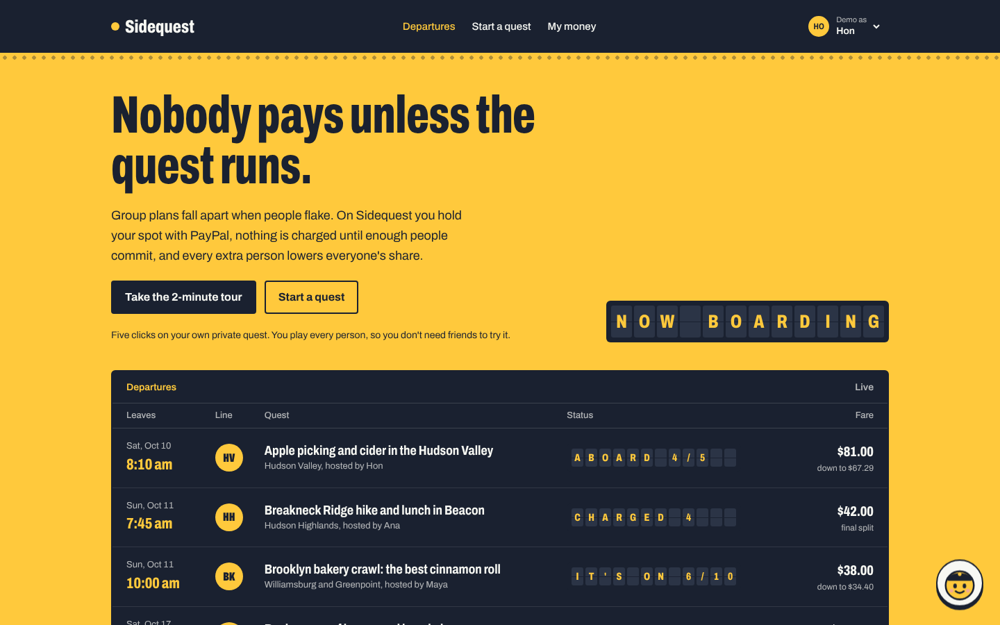
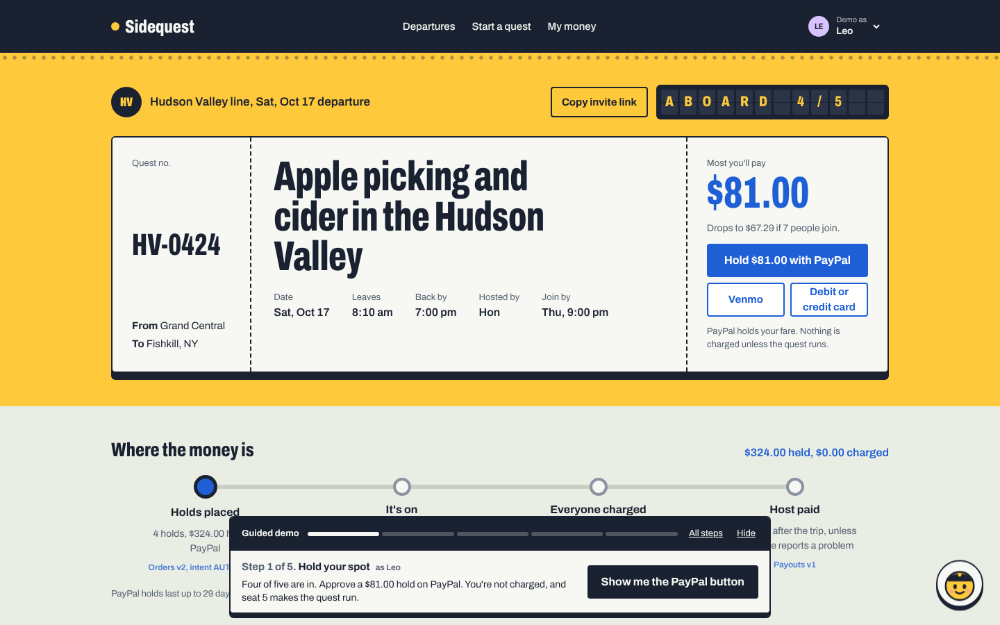
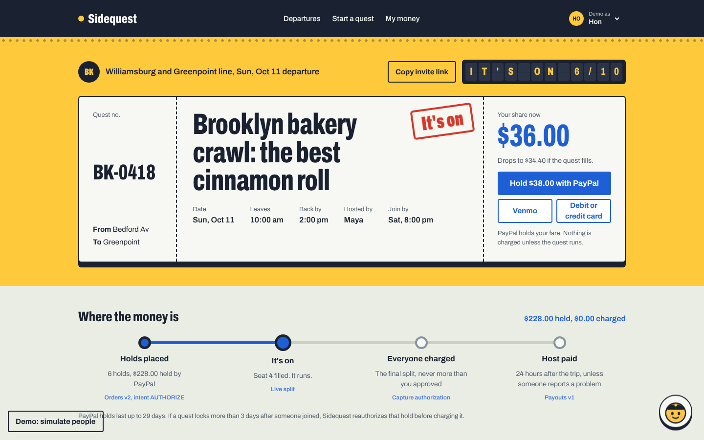
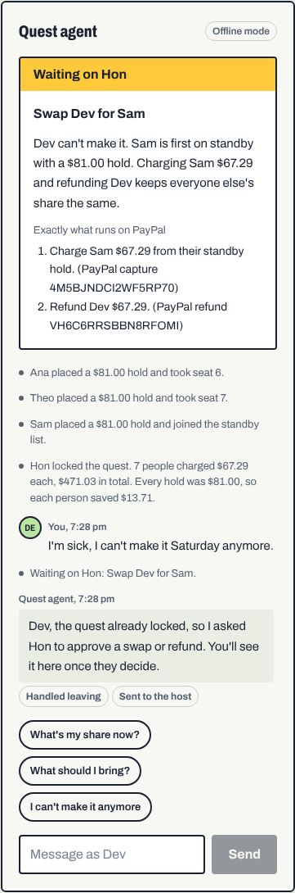
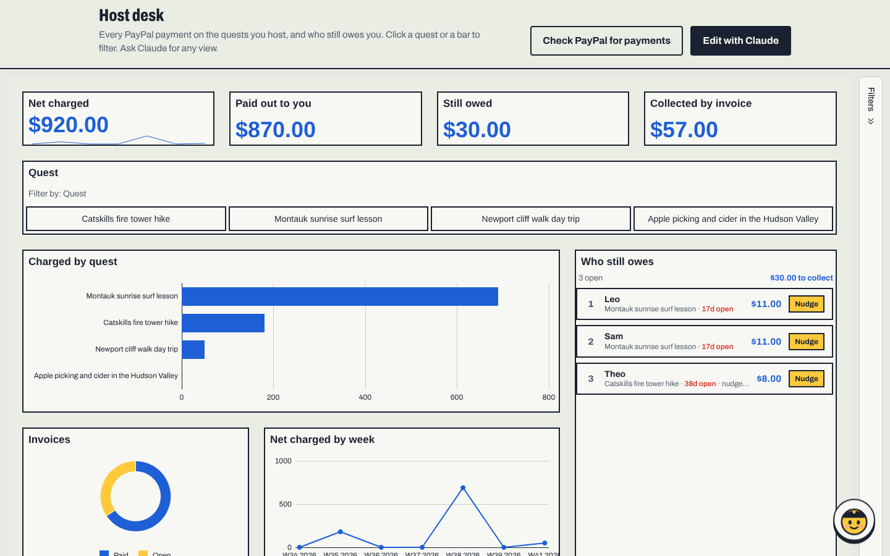
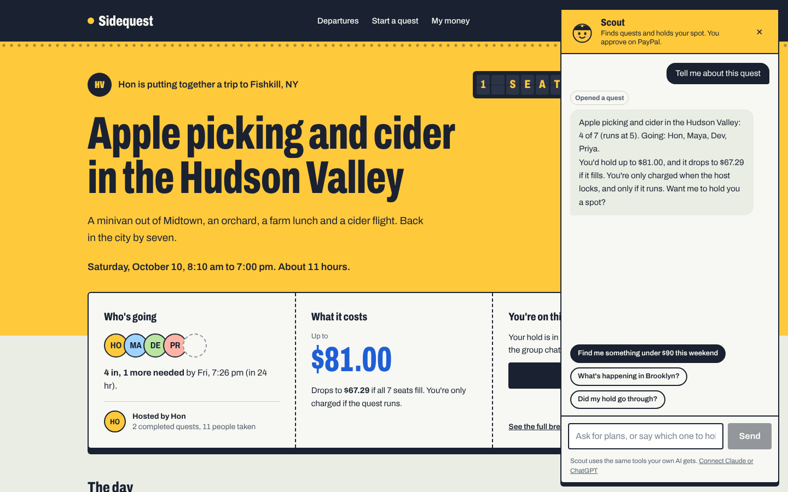
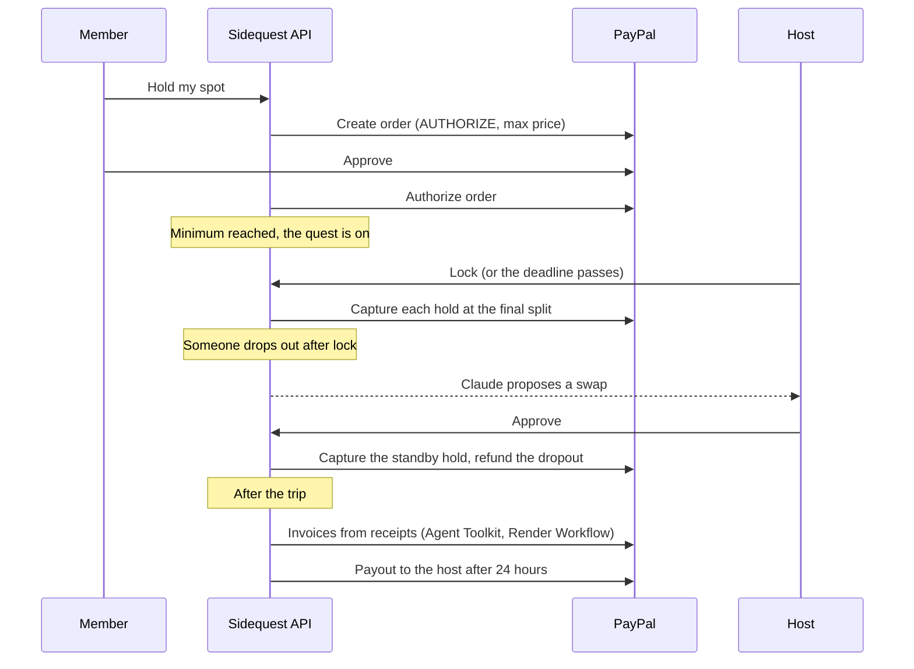

# Sidequest

**Nobody pays unless the quest runs.**

[](https://github.com/honruiliew-bit/side-quest/actions/workflows/ci.yml)
[](LICENSE)
[](https://sidequest-web-q5pq.onrender.com)

Group plans die in the group chat. Four people say "maybe", one person books the van, and that person ends up fronting the money and chasing everyone for it.
<!-- After the real-user test, add one line here: how many people held spots and how many went. -->

Sidequest fixes the commitment problem with a payment primitive PayPal already has: **authorize now, capture later.**

1. **Hold your spot.** You approve a PayPal hold for the most you could pay. Nothing is charged.
2. **It runs or it doesn't.** When enough people commit, the host locks and everyone pays the real split, which drops with every extra person. If not enough people commit, every hold is released.
3. **Claude does the admin.** It swaps dropouts with people on standby, reads receipts to settle up with refunds or PayPal invoices, and the host is paid 24 hours after the trip. Claude only proposes money moves. The host approves each one.

**[Try the live demo](https://sidequest-web-q5pq.onrender.com)** and click **Take the 2-minute tour**. Built for the [PayPal AI Hackathon](https://paypalaihackathon.devpost.com).



---

## Contents

- [Try it in two minutes](#try-it-in-two-minutes)
- [What's inside](#whats-inside)
- [How the money moves](#how-the-money-moves)
- [Safety and quality](#safety-and-quality)
- [Run it locally](#run-it-locally)
- [Deploy on Render](#deploy-on-render)
- [Tests](#tests)
- [Project layout](#project-layout)

---

## Try it in two minutes

Open the [live demo](https://sidequest-web-q5pq.onrender.com) and click **Take the 2-minute tour**. You get a private copy of a quest, and a bar at the bottom walks you through five steps. Each step switches to the right person for you, so you can play every side alone.

| Step | You play | What happens on PayPal |
|---|---|---|
| 1. Hold your spot | Leo | Approve a $81.00 hold with PayPal's own button. Seat 5 fills and the quest runs. |
| 2. It's on: lock and charge | Hon, the host | More people join, the share drops to $67.29, and every hold is captured at that split. |
| 3. Someone drops out | Dev, then Hon | Dev tells the group chat he's sick. Claude asks the host, who approves: charge the standby, refund Dev. |
| 4. Settle up from a receipt | Hon | Claude reads the gas receipt. Each person gets a PayPal invoice for their share, with the receipt linked. |
| 5. The host gets paid | anyone | A PayPal payout to the host. In real use it waits 24 hours after the trip. |

The sandbox buyer login is shown in step 1. The **money log** on the quest page lists every PayPal call with its ID.

Then try:
- **My money** as Hon: the host desk. Press **Nudge** on Leo, or **Edit with Claude** and **Nudge the oldest invoice**.
- **Scout**, the assistant in the bottom-right corner: ask for "something under $90 this weekend" and it can hold your spot.



---

## What's inside

### PayPal, end to end

| PayPal capability | Where Sidequest uses it |
|---|---|
| Orders v2, `intent: AUTHORIZE` | Holding a spot at the price for the minimum group, the most anyone can pay |
| Capture authorization (partial, `final_capture`) | Locking a quest. Each hold is captured at the real split, never above the hold |
| Void authorization | Leaving before lock, quests that don't reach their minimum, unused standby holds |
| Reauthorize | Holds older than the 3-day honor period are reauthorized before capture |
| Refund capture | Dropout swaps after lock, and refunds when costs come in under |
| Payouts v1 | Paying the host 24 hours after the trip, unless a member reports a problem |
| Invoicing, through the **PayPal Agent Toolkit** | Billing each person when costs come in over, receipts linked on the invoice |
| Invoice reminders | Friendly nudges from the host desk, sent by PayPal with the pay button |
| Webhooks with signature verification | Confirming holds, captures, voids, refunds, payouts and paid invoices |
| JS SDK Smart Buttons | PayPal, Venmo and cards. Pay Later is off because installments can't be held |



### Claude, with guardrails

- **Quest builder.** One sentence becomes a full quest: date, stops, meet point and an honest cost split.
- **Quest agent.** Runs the group chat, answers questions, and handles dropouts and cost changes. It can read the quest, act for the person speaking, and propose money moves. It can't move money. The host sees exactly what will run on PayPal and approves it.
- **Receipt reader.** Claude reads each receipt photo (merchant, date, total, and which cost it covers). The engine then runs checks that don't depend on the model: duplicates are rejected, dates outside the trip and totals far above the estimate are flagged, and anything that isn't a receipt is rejected.
- **PayPal Agent Toolkit, adapted for Claude.** The toolkit ships adapters for OpenAI Agents, LangChain and CrewAI. Sidequest uses its shared layer with a Claude adapter, for invoices and read-only order lookups.



### Host desk (AG Studio)

Hosts get a dashboard on **My money**, built with [AG Studio](https://www.ag-grid.com/studio/) and themed to match the app.

- Net charged, paid out, still owed and collected by invoice, charges by quest, invoices by status, a weekly trend and a grid of every PayPal call. Everything cross-filters.
- **Who still owes**, a custom widget: open PayPal invoices ranked by amount, days open and nudges sent. **Nudge** opens a reminder the host can edit before PayPal sends it. At most 3 per person, 12 hours apart.
- **Edit with Claude**: AG Studio's five built-in agents run on Claude through the API (`POST /studio/llm`), so the key never reaches the browser. One extra tool, `draft_payment_reminder`, lets Claude write a nudge. Only the host can send it.
- On a phone, the desk becomes a simple "Who still owes" list.



### Scout and MCP

**Sidequest is an MCP server** at `/mcp/` with four tools: `list_quests`, `get_quest`, `hold_spot` and `check_my_spot`. Claude, ChatGPT or any MCP client can find a quest and start a hold. The person still approves the hold on PayPal's own page, so an agent can commit you to a plan but can never spend without you.

**Scout**, the little assistant in the corner of every page, uses the same four tools, so you can try agentic commerce without installing anything. The **For AI agents** page (in the footer) has setup steps for Claude, Claude Desktop and ChatGPT.



### Render

One Blueprint deploys the whole stack, including a **Cron Job** that runs the money clock and a **Workflow** that sends settle-up invoices in parallel. See [Deploy on Render](#deploy-on-render).

---

## How the money moves



**The host is paid by escrow, not by trust.** Members' money is captured when the quest locks, so nobody can skip paying. The host can't take the money early either: the payout releases on its own 24 hours after the trip, and any member who paid can report a problem to pause it.

---

## Safety and quality

- **Money rules live in one engine.** A capture can never exceed the hold, and a refund can never exceed the capture. Every proposal is re-checked at approval time.
- **Every money move is serialized per quest.** Two people can't take the same seat, and a webhook and a click can't authorize the same order twice.
- **Each approval runs once.** Proposals are claimed atomically, and duplicates collapse into one card.
- **No double billing.** Invoice numbers are deterministic, so a retried send finds the invoice it already sent instead of billing again.
- **Holds fit PayPal's window.** Join deadlines must be within 28 days, because authorizations last 29.
- **Prompt injection resistant.** Member messages are treated as data, so one person can't talk Claude into moving someone else's money.
- **CI** runs 31 backend tests (money lifecycle, races, webhooks, MCP, the Claude tool loop through the real SDK, the Render Workflow tasks) plus type checks, lint and a production build.

---

## Run it locally

No keys needed. Without them, PayPal runs in mock mode and Claude runs a rule-based offline mode, so everything works end to end. Requires Python 3.11+ and Node 18+.

```bash
# Backend
cd backend
python3 -m venv .venv && source .venv/bin/activate
pip install -r requirements.txt
pip install --no-deps paypal-agent-toolkit==1.11.0
cp .env.example .env
python -m uvicorn main:app --reload

# Frontend, in a second terminal
cd frontend
cp .env.example .env.local
npm install
npm run dev
```

Open http://localhost:3000. Demo quests are seeded at every stage, plus two past trips with open invoices for the host desk.

### Turn on the PayPal sandbox

1. At [developer.paypal.com](https://developer.paypal.com), open **Apps & Credentials > Sandbox** and create an app. Put the client ID and secret in `backend/.env` as `PAYPAL_CLIENT_ID` and `PAYPAL_CLIENT_SECRET`.
2. Check you have a sandbox business account (receives holds, sends payouts) and a personal account (approves holds).
3. Run the check script. It walks through authorize, partial capture, refund, void, payout and an Agent Toolkit invoice against the real sandbox:
   ```bash
   cd backend && python scripts/check_sandbox.py
   ```
4. Restart the backend. The header badge now says **PayPal sandbox**.
5. For judges, set `DEMO_BUYER_EMAIL` and `DEMO_BUYER_PASSWORD` to a sandbox personal account. The tour shows them in step 1. They only appear in sandbox mode with `DEMO_MODE=1`.

**Webhooks.** Point a sandbox webhook at `https://<your-api>/webhooks/paypal` with all events, or at least `CHECKOUT.ORDER.APPROVED`, `PAYMENT.AUTHORIZATION.*`, `PAYMENT.CAPTURE.*`, `PAYMENT.PAYOUTS*`, `INVOICING.INVOICE.PAID` and `INVOICING.INVOICE.CANCELLED`. Set its ID as `PAYPAL_WEBHOOK_ID`. Each event is verified with PayPal's `verify-webhook-signature` endpoint and stored once.

### Turn on Claude

Set `ANTHROPIC_API_KEY` in `backend/.env`. `ANTHROPIC_MODEL` defaults to `claude-sonnet-5-5`.

### AG Studio licence

Without a key, AG Studio runs as a trial and shows a watermark on non-localhost hosts. Set `NEXT_PUBLIC_AG_STUDIO_LICENSE` on the frontend to remove it.

---

## Deploy on Render

`render.yaml` is a [Render](https://render.com) Blueprint. In the dashboard choose **New > Blueprint** and point it at this repo.

| Resource | Type | What it does |
|---|---|---|
| `sidequest-api` | Web service (Python) | FastAPI, the quest engine, PayPal, Claude and the MCP server |
| `sidequest-web` | Web service (Node) | The Next.js app |
| `sidequest-db` | Render Postgres | All data. Tables are created on first start |
| `sidequest-clock` | Cron Job, every 30 min | Starts or cancels quests at their deadline, locks fares, releases host payouts, even when nobody has the site open |
| `sidequest-settle` | Workflow | Settle up: one `send_invoice` task per person, each on its own instance with retries |

**Why a Workflow for settle up.** Seven invoices are seven PayPal round trips that can each fail on their own. On Render Workflows each is a separate task run with automatic retries, and one failure doesn't stop the rest. The tasks never touch the database: the API starts the run, waits for the results and applies them under the quest lock. If the run can't start, the API sends the invoices itself. The money log notes which run sent each invoice.

Render asks for the `sync: false` values: PayPal keys, the Anthropic key, the sandbox buyer login, the public URLs, and a `RENDER_API_KEY` (Account Settings > API Keys) so the API can start workflow runs. Set `API_URL` on the cron job to the API's public URL.

The database uses the smallest paid plan, because free Render Postgres expires after 30 days. Keep `DEMO_MODE=1` for judging.

---

## Tests

```bash
cd backend
python -m pytest tests/test_flow.py        # full money lifecycle, webhooks, MCP, settle up
python -m pytest tests/test_qa.py          # races, closed quests, limits, host desk, receipts, workflows
python -m pytest tests/test_agent_wire.py  # Claude tool loop through the real SDK, on a fake transport
python -m pytest tests/test_workflows.py   # Render Workflow tasks: fan-out, failures, no double billing
```

Run each file on its own. Each sets up its own database.

---

## Project layout

```
backend/
  main.py                   FastAPI app, scheduler, MCP mount
  workflows.py              Render Workflow: settle_up and send_invoice tasks
  app/engine.py             Quest lifecycle. Every money move goes through here
  app/api.py                REST API
  app/books.py              Host desk data, invoice reminders, Claude proxy for AG Studio
  app/paypal/gateway.py     Orders, Payments, Payouts, Webhooks (sandbox and mock)
  app/paypal/toolkit.py     PayPal Agent Toolkit, adapted for Claude
  app/agent/                Quest builder, quest agent, receipt reader, Scout
  app/mcp_server.py         Sidequest as an MCP server
  app/render_workflows.py   Starts and waits on workflow runs
  scripts/                  check_sandbox.py, tick.py (Render Cron Job)
frontend/
  src/app/                  Departures, invite page, quest page, builder, My money, For AI agents
  src/components/           Ticket, departure board, seat map, money route, agent panel, tour bar, Scout
  src/studio/               AG Studio host desk: data, dashboard, Who still owes widget, Claude adapter
render.yaml                 Render Blueprint: API, web, Postgres, Cron Job, Workflow
docs/                       Devpost write-up, demo script, screenshots
```

---

## License

[MIT](LICENSE)
